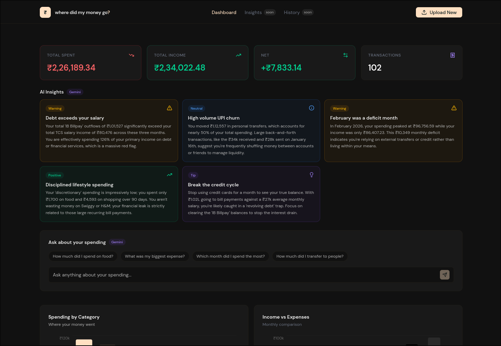

# Where Did My Money Go? — Frontend

A stateless, AI-powered bank statement analyzer. Upload a PDF, get instant spending insights — no account, no data storage, no nonsense.

**Live demo:** [https://where-did-my-money.netlify.app]



---

## What it does

- Upload any Indian bank statement PDF
- Instantly see spending broken down by category, merchant, and month
- Get AI-generated insights about your spending patterns
- Ask natural language questions about your transactions
- Everything runs in your session — nothing is stored

---

## Tech stack

- **React 18** + **TypeScript**
- **Vite** for bundling
- **Tailwind CSS v4** for styling
- **shadcn/ui** (Nova theme) for components and charts
- **Recharts** under the hood for data visualization
- **DM Sans** for typography

---

## Features

| Feature | Description |
|---|---|
| PDF Upload | Drag or select a bank statement PDF |
| Summary Strip | Total spent, income, net, transaction count |
| Spending by Category | Bar chart with click-to-filter drill-down |
| Income vs Expenses | Monthly grouped bar comparison |
| Monthly Trend | Line chart across statement period |
| Top Merchants | Horizontal bar, ranked by total spend |
| Biggest Transactions | Ranked list of largest single debits |
| Daily Heatmap | GitHub-style spending intensity grid |
| Transactions Table | Filterable by category, sortable by date/amount |
| AI Insights | 5 Gemini-generated observations about your patterns |
| Natural Language Q&A | Ask questions, get answers from your own data |
| Loading Skeleton | Animated placeholder while analysis runs |

---

## Getting started

### Prerequisites
- Node.js 18+
- pnpm
- Backend running locally (see backend README)

### Install and run

```bash
git clone https://github.com/zishan29/where-my-money-frontend
cd where-my-money-frontend
pnpm install
pnpm dev
```

App runs on `http://localhost:5173`

### Environment

```env
VITE_API_URL=https://where-did-my-money-go-express.onrender.com/api/parse
```

Then replace hardcoded URLs with `import.meta.env.VITE_API_URL`.

---

## Project structure

src/
├── components/
│   ├── Navbar.tsx              # Fixed top nav with upload trigger
│   ├── EmptyState.tsx          # Landing state before upload
│   ├── LoadingSkeleton.tsx     # Animated placeholder during analysis
│   ├── SummaryStrip.tsx        # Four stat cards
│   ├── InsightsStrip.tsx       # AI insight cards
│   ├── ChatQA.tsx              # Natural language Q&A interface
│   ├── ChartsRow.tsx           # Category + income vs expense charts
│   ├── MonthlyTrend.tsx        # Line chart
│   ├── MerchantsAndTop.tsx     # Top merchants + biggest transactions
│   ├── DailyHeatmap.tsx        # Calendar heatmap
│   └── TransactionsTable.tsx   # Filterable transactions list
└── App.tsx                     # Root component, state management

---

## How the AI works

This app makes **three separate Gemini API calls** per upload:

1. **Parse** — raw PDF text → structured JSON array of transactions
2. **Insights** — transaction data → 5 opinionated observations
3. **Q&A** — user question + transaction data → direct answer

All calls go through the Express backend. The frontend never touches the Gemini API directly.

---

## Deployment

Deployed on **Netlify**. Connect your GitHub repo and it deploys automatically on push. No build configuration needed — Vite is auto-detected.
